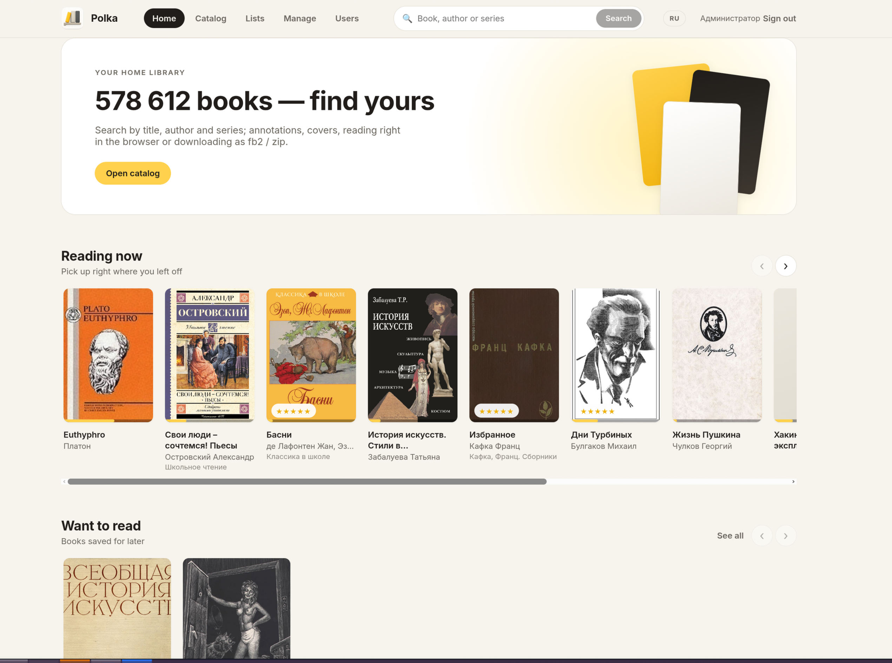

# Polka 

**Your home e-book library — fast, private, and beautiful.**

Polka (Russian for *"bookshelf"*) is a self-hosted library for e-book
collection. Point it at a folder of books — or import a huge `.inpx` catalog —
and get a polished web interface with search, covers, annotations, an online
reader, reading lists, ratings, recommendations, and an OPDS feed for every
mobile reading app.




---

## Highlights

- **Built for big collections.** A 690,000-book catalog imports in about a
  minute and stays instant to browse and search (SQLite + FTS5 under the hood).
- **Read in your browser.** A clean, newspaper-style reader for FB2, EPUB and
  TXT with continuous scrolling, themes (light / sepia / dark), adjustable
  fonts, footnotes, live tables of contents, and per-user reading progress.
  PDF opens in a dedicated reader with the same progress tracking.
- **Find your next book.** Personal shelves: *Reading now*, *Want to read*,
  *Continue the series*, and *For you* — recommendations scored from your
  ratings, lists, and reading history. Plus "similar books" on every book page,
  optionally enriched by external sources (FantLab, TasteDive).
- **Search everything.** Titles, authors, series, genres — and ISBN: paste an
  ISBN in any format and Polka finds the book locally or resolves it via
  Open Library / Google Books.
- **Reading lists & ratings.** Build custom lists, mark books you want to read,
  rate books 1–5 — average ratings are visible to everyone on your server.
  External ratings (LiveLib, Google Books, Open Library) can be enabled per
  source by the admin.
- **OPDS catalog.** Connect Moon+ Reader, KOReader, FBReader, or any other
  OPDS-capable app: new books, genres, your "reading now" shelf, and search.
- **Multi-user.** Accounts with admin/reader roles, per-user progress, lists
  and ratings. Or run it fully open on a trusted home network.
- **Add books from the browser.** Upload fb2 / epub / pdf / djvu / txt / mobi;
  metadata is extracted automatically and three-level duplicate detection
  (file hash → text hash → fuzzy metadata) keeps your collection clean.
- **Two languages.** English and Russian UI, switchable in one click; genre
  names and the OPDS feed are localized too.
- **Mobile-friendly + PWA.** Add Polka to your phone's home screen and it
  behaves like an app.
- **Desktop apps that don't need a server.** Native-feel clients for Windows
  and Linux work fully standalone: your library, reader, lists and ratings
  live right on your machine — no server, no account, no internet required.
  Optionally connect them to your Polka server later and get two-way sync of
  progress, ratings, and lists, including offline copies of selected books.

## Quick start

### Docker (recommended for servers)

```sh
docker run -d --name polka \
  -p 12791:12791 \
  -v polka-data:/data \
  -v /path/to/your/books:/books \
  ghcr.io/vestigiumincaligne/polka:latest
```

Open `http://localhost:12791`, sign in with the bootstrap admin account
(created on first run — see the container log: `docker logs polka`), and start
exploring. Or use [docker-compose.yml](docker-compose.yml):

```sh
docker compose up -d
```

### Desktop app — no server required

If you just want a personal library on one computer, skip the server entirely:
install the desktop app from the [releases](../../releases) page
(`polka-setup-<version>.exe` on Windows, `.deb`/`.rpm` on Linux) and launch
**Polka**. It opens in its own window, stores everything locally, and works
offline. You can connect it to a server later at any time — nothing to
reconfigure.

### Prebuilt binaries and installers

Grab the latest [release](../../releases):

| Platform | What you get |
|----------|--------------|
| Windows  | `polka-setup-<version>.exe` — installer for the desktop app (server included) |
| Linux    | `.deb` / `.rpm` packages (amd64, arm64), plus standalone binaries |
| Raspberry Pi | 64-bit OS → `polka-linux-arm64` (or the arm64 `.deb` / Docker); 32-bit OS → `polka-linux-arm` |
| Any      | `polka` server binary — single file, no dependencies |

Run the server directly:

```sh
polka serve --library-dir /path/to/books
```

### Build from source

Requires Go 1.26+ and Node 20+.

```sh
git clone https://github.com/vestigiumincaligne/polka
cd polka
make build        # builds web UI + bin/polka + bin/polka-desktop
./bin/polka serve --library-dir /path/to/books
```

## Importing a large catalog

Polka understands `.inpx` index files (MyHomeLib / Flibusta format) — both
from the command line and from the web UI (*Manage → Import*):

```sh
polka import --inpx collection.inpx --data-dir /path/to/data --library-dir /path/to/archives
```

You can also import an inpx that already sits on the server (e.g. a
mounted or NFS collection) straight from the web UI — paste its path in
*Manage → Import* instead of uploading. The book archives are looked up
under `--library-dir`.

Hundreds of thousands of records import in about a minute. Re-importing
replaces the catalog but **never touches user data** — accounts, progress,
ratings and lists live in a separate database and survive re-imports.

## The desktop apps

`polka-desktop` opens Polka in its own window (WebView2 on Windows, Chromium
app window on Linux) and can work two ways:

- **Standalone (default)** — a personal library on your computer. No server,
  no sign-in, works completely offline.
- **Connected** — point it at your Polka server (*Server* page in the app):
  the full catalog is available online, selected books are downloaded for
  offline reading, and progress / ratings / lists sync both ways automatically.

## OPDS

Point your reading app at `http://your-server:12791/opds` — no converting or
copying files, the books open straight on the device. Authentication is HTTP
Basic with your Polka account. The catalog has new books, **browse by author,
by series, and by genre** (alphabetical), search, and a personal "Reading now"
feed; downloads work in fb2, zip, epub, and pdf. The admin can turn OPDS on or
off and copy the connection address in *Manage → OPDS*.

## Configuration

Everything has a sensible default. The most useful flags of `polka serve`:

| Flag | Default | Meaning |
|------|---------|---------|
| `--addr` | `:12791` | listen address |
| `--data-dir` | `~/.polka` | database, settings, covers cache |
| `--library-dir` | — | folder with books (or inpx archives) |
| `--auth` | `users` | `users` (accounts) or `none` (open access) |

External rating/recommendation sources are configured in the web UI
(*Manage → External ratings / Similar books*) and are **off by default**
except local recommendations — nothing is queried without the admin's
consent.

## Tech notes

- Single Go binary; the React frontend is embedded at build time.
- SQLite (pure-Go driver) with WAL and FTS5 — no database server to run.
- User data (accounts, sessions, progress, ratings, lists) is stored
  separately from the catalog and survives re-imports.
- Sync between desktop clients and the server is state-based with
  last-write-wins per record.

## Support the project ❤️

Polka is free and MIT-licensed. If it made your library nicer, you can support
development through the **Sponsor** button on this repository — it genuinely
helps.

Bug reports and feature ideas are welcome in [Issues](../../issues).

## License

[MIT](LICENSE)
